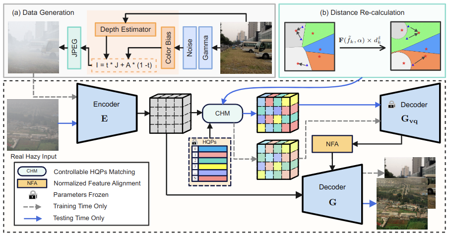
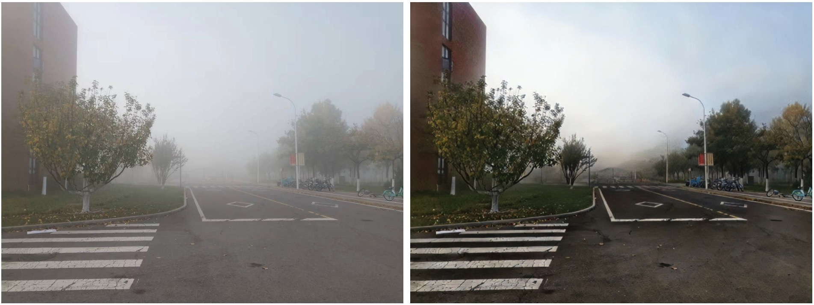
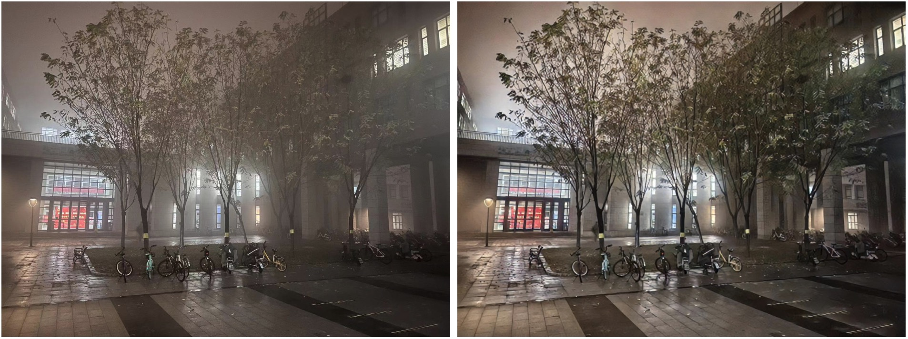

# <p align=center> :fire: `RIDCP: Revitalizing Real Image Dehazing via High-Quality Codebook Priors (CVPR2023)`</p>

 

This is the official PyTorch codes for the paper.  
>**RIDCP: Revitalizing Real Image Dehazing via High-Quality Codebook Priors**<br>  [Ruiqi Wu](https://rq-wu.github.io/), [Zhengpeng Duan](https://github.com/Adam-duan), [Chunle Guo<sup>*</sup>](https://scholar.google.com/citations?user=RZLYwR0AAAAJ&hl=en), [Zhi Chai](), [Chongyi Li](https://li-chongyi.github.io/) （ * indicates corresponding author)<br>
>The IEEE / CVF Computer Vision and Pattern Recognition Conference (CVPR), 2023



[[Arxiv Paper](https://arxiv.org/abs/2304.03994)]  [中文版 (TBD)] [[Website Page](https://rq-wu.github.io/projects/RIDCP/index.html)]  [[Dataset](https://pan.baidu.com/s/1oX3AZkVlEa7S1sSO12r47Q) (pwd:qqqo)]

### :rocket: Highlights:
- **SOTA performance**: The proposed RIDCP achieves superior performance in both qualitative and quantitative comparisons with SOTA methods.
- **Adjustable**: Our RIDCP can adjust the degree of enhancement manually.
### :page_facing_up: Todo-list
- Release code for VQGAN pre-training and CHM weights acquiring
- Website page
- Colab demo

## Demo



### Video examples
 &nbsp; &nbsp; &nbsp; &nbsp; 

## Dependencies and Installation

- Ubuntu >= 18.04
- CUDA >= 11.0
- Other required packages in `requirements.txt`
```
# git clone this repository
git clone https://github.com/RQ-Wu/RIDCP.git
cd RIDCP

# create new anaconda env
conda create -n ridcp python=3.8
conda activate ridcp 

# install python dependencies
pip install -r requirements.txt
BASICSR_EXT=True python setup.py develop
```

## Get Started
### Prepare pretrained models & dataset
1. Downloading pretrained checkpoints
<table>
<thead>
<tr>
    <th>Model</th>
    <th> Description </th>
    <th>:link: Download Links </th>
</tr>
</thead>
<tbody>
<tr>
    <td>HQPs</td>
    <th>VQGAN pretrained on high-quality data.</th>
    <th rowspan="3">
    [<a href="">Google Drive (TBD)</a>] 
    [<a href="https://pan.baidu.com/s/1ps9dPmerWyXILxb6lkHihQ">Baidu Disk (pwd: huea)</a>]
    </th>
</tr>
<tr>
    <td>RIDCP</td>
    <th>Dehazing network trained on data generated by our pipeline.</th>
</tr>
<tr>
    <td>CHM</td>
    <th>Weight for adjusting controllable HQPs matching.</th>
</tr>
</tbody>
</table>

2. Preparing data for training
<table>
<thead>
<tr>
    <th>Dataset</th>
    <th> Description </th>
    <th>:link: Download Links </th>
</tr>
</thead>
<tbody>
<tr>
    <td>rgb_500</td>
    <th>500 clear RGB images as the input of our phenomenological degradation pipeline</th>
    <th rowspan="2">
    [<a href="">Google Drive (TBD)</a>] 
    [<a href="https://pan.baidu.com/s/1oX3AZkVlEa7S1sSO12r47Q">Baidu Disk (pwd: qqqo)</a>]
    </th>
</tr>
<tr>
    <td>depth_500</td>
    <th>Corresponding depth map generated by RA-Depth(https://github.com/hmhemu/RA-Depth).</th>
</tr>
<tr>
    <td>Flick2K, DIV2K</td>
    <th>High-quality data for VQGAN pre-training</th>
    <th>-</th>
</tr>
</tbody>
</table>

3. The final directory structure will be arranged as:
```
datasets
    |- clear_images_no_haze_no_dark_500
        |- xxx.jpg
        |- ...
    |- depth_500
        |- xxx.npy
        |- ...
    |- Flickr2K
    |- DIV2K

pretrained_models
    |- pretrained_HQPs.pth
    |- pretrained_RIDCP.pth
    |- weight_for_matching_dehazing_Flickr.pth
```
### Quick demo
Run demos to process the images in dir `./examples/` by following commands:
```
python inference_ridcp.py -i examples -w pretrained_models/pretrained_RIDCP.pth -o results --use weight --alpha -21.25
```

### Train RIDCP
Step 1: Pretrain a VQGAN on high-quality dataset
```
TBD
```

Step 2: Train our RIDCP
```
CUDA_VISIBLE_DEVICES=X,X,X,X python basicsr/train.py --opt options/RIDCP.yml
```

Step3: Adjust our RIDCP
```
TBD
```

## Citation
If you find our repo useful for your research, please cite us:
```
@inproceedings{wu2023ridcp,
    title={RIDCP: Revitalizing Real Image Dehazing via High-Quality Codebook Priors},
    author={Wu, Ruiqi and Duan, Zhengpeng and Guo, Chunle and Chai, Zhi and Li, Chongyi},
    booktitle={Proceedings of the IEEE/CVF Conference on Computer Vision and Pattern Recognition},
    year={2023}
}
```

## License
Licensed under a [Creative Commons Attribution-NonCommercial 4.0 International](https://creativecommons.org/licenses/by-nc/4.0/) for Non-commercial use only.
Any commercial use should get formal permission first.

## Acknowledgement
This repository is maintained by [Ruiqi Wu](https://rq-wu.github.io/).
